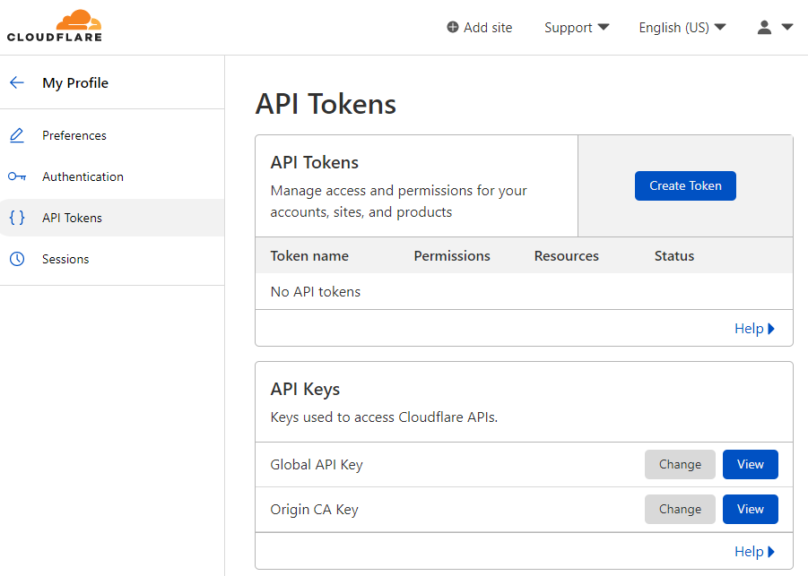
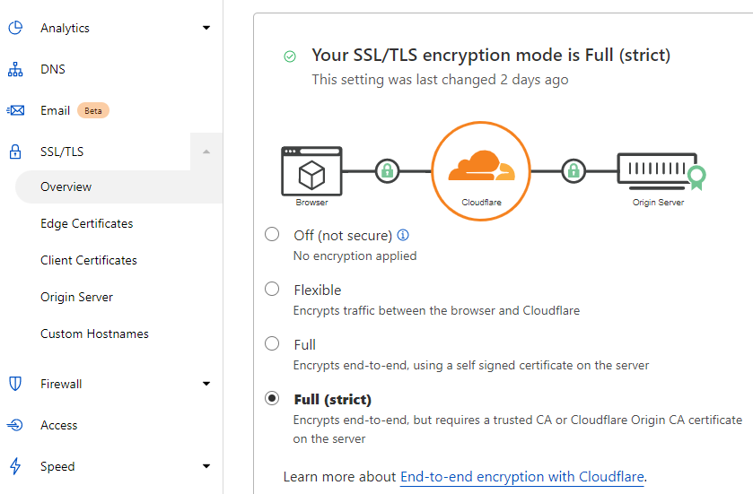
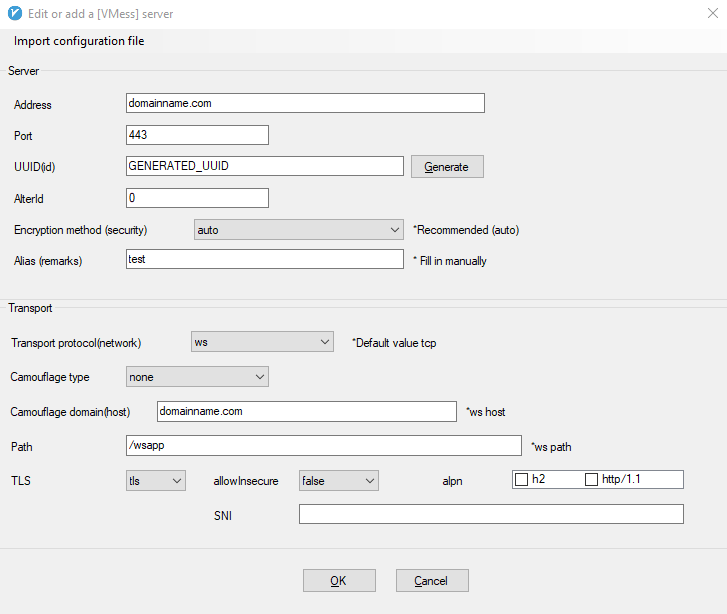
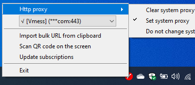

# V2ray+Nginx+Websocket+TLS+CDN Clean Configuration

V2ray protocal configured with Nginx, Websocket, TLS and CDN to improve proxy speed and security.

## Requirements
- A Virtual Private Server (example IP address: 123.456.789.10)
- A registered domain name (example name: domainname.com)
- Cloudflare account

After [pointing domain nameservers to Cloudflare](https://developers.cloudflare.com/dns/zone-setups/full-setup/setup/), add a DNS A Record on Cloudflare. 


## Server Configuration
Install prerequisites
```bash
apt-get update && apt-get install nginx curl ufw socat
```

The time difference between server and client should be less than 90s.

Check and set server time 
```bash
date -R
sudo timedatectl set-local-rtc 1
sudo timedatectl set-timezone Asia/Shanghai
```

Open 80 and 443 port
```bash
sudo ufw allow 80
sudo ufw allow 443
```

Install V2ray
```bash
sudo bash <(curl -L https://raw.githubusercontent.com/v2fly/fhs-install-v2ray/master/install-release.sh)
```

Issue TLS certificate for the website. Here an API Key is needed, it can be found in Cloudflare website=>My profile=>API Tokens=>Global API Key=>View 



```bash
sudo curl  https://get.acme.sh | sh
source ~/.bashrc
sudo export CF_Key="MY_API_KEY"
sudo export CF_Email="MY_CLOUDFLARE_EMAIL_ADDRESS"
sudo acme.sh --issue --dns dns_cf -d domainname.com -d *.domainname.com -k ec-256
sudo acme.sh --installcert -d domainname.com -d *.domainname.com --fullchainpath /usr/local/etc/v2ray/domainname.com.crt --keypath /usr/local/etc/v2ray/domainname.com.key --ecc
```

`config.json` is the config file of V2ray which usually locates in the "/usr/local/etc/v2ray/".

```bash
nano /usr/local/etc/v2ray/config.json
```
Change the content of  `config.json` as below, the UUID([generate a UUID](https://www.uuidgenerator.net/)), port number and websocket path can be customized.
```json
{
  "inbounds": [
    {
      "port": 12345,
      "listen": "127.0.0.1",
      "tag": "vmess-in",
      "protocol": "vmess",
      "settings": {
        "clients": [
          {
            "id": "GENERATED_UUID",
            "alterId": 0
          }
        ]
      },
      "streamSettings": {
        "network": "ws",
        "wsSettings": {
          "path": "/wsapp"
        }
      }
    }
  ],
  "outbounds": [
    {
      "protocol": "freedom",
      "settings": {},
      "tag": "direct"
    },
    {
      "protocol": "blackhole",
      "settings": {},
      "tag": "blocked"
    }
  ],
  "routing": {
    "domainStrategy": "AsIs",
    "rules": [
      {
        "type": "field",
        "inboundTag": [
          "vmess-in"
        ],
        "outboundTag": "direct"
      }
    ]
  }
}
```

The cofiguration file of Nginx can be put under "/etc/nginx/conf.d/default.conf", a website can be hosted under "/var/www/mysite".

```bash
sudo mkdir /var/www/mysite
nano /etc/nginx/conf.d/default.conf
```
Change the content of `default.conf` as follow:

```
server {
    listen 443 ssl;
    ssl on;
    ssl_certificate /usr/local/etc/v2ray/domainname.com.crt;
    ssl_certificate_key /usr/local/etc/v2ray/domainname.com.key;
    ssl_protocols TLSv1 TLSv1.1 TLSv1.2 TLSv1.3;
    ssl_ciphers HIGH:!aNULL:!MD5;
    ssl_prefer_server_ciphers on;
    ssl_session_cache shared:SSL:10m;
    ssl_session_timeout 10m;
    server_name domainname.com;
    index index.html index.htm;
    root /var/www/mysite;
    location /wsapp
    {
        proxy_redirect off;
        proxy_pass http://127.0.0.1:12345;
        proxy_http_version 1.1;
        proxy_set_header Upgrade $http_upgrade;
        proxy_set_header Connection "upgrade";
        proxy_set_header Host $http_host;
    }
    add_header Strict-Transport-Security "max-age=31536000; includeSubDomains" always;
}

```

Set V2ray and Nginx to run at startup
```bash
systemctl enable v2ray
systemctl enable nginx
systemctl restart nginx
systemctl status nginx
systemctl restart v2ray
systemctl status v2ray
```
On Cloudflare, set the TLS encryption mode to "Full".




## Client Configuration
 
Many GUI Clients are available for different OS. 
- [Shadowrocket](https://apps.apple.com/us/app/shadowrocket/id932747118)
- [v2rayNG](https://play.google.com/store/apps/details?id=com.v2ray.ang)
- [v2rayN](https://github.com/2dust/v2rayN)
- [clashX](https://github.com/yichengchen/clashX)

In GUI Client, add a "VMess" server, input **previously configured** domain address, UUID, websocket path.





Enjoy unlimited Internet access!